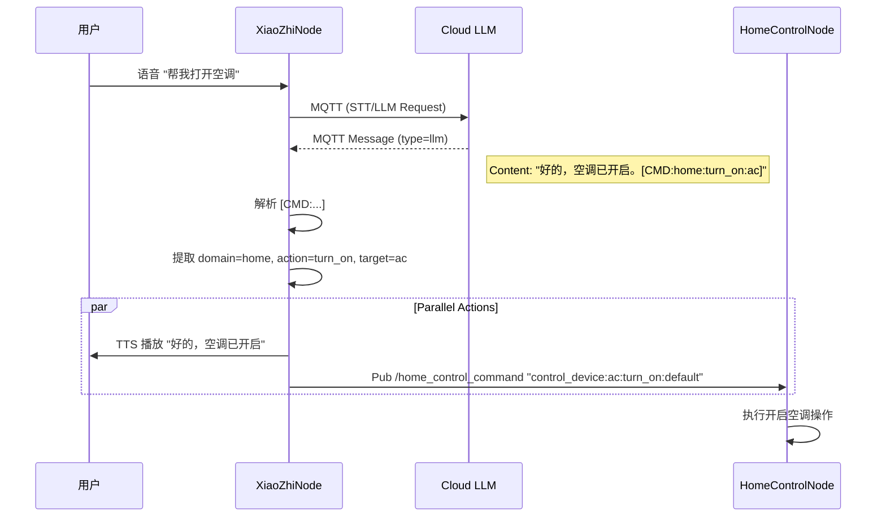

# 小智助手集成方案 (XiaoZhi Assistant Integration Scheme)

**版本**：v1.0
**日期**：2026-01-28
**状态**：草稿

---

## 1. 引言

### 1.1 目的
本文档描述了将“小智”语音助手（`voice_interaction`模块）与机器人其他功能模块（`home_control`、`life_assistance`等）进行集成的技术方案。目标是实现用户通过语音指令控制家电、设置提醒等功能。

### 1.2 背景
目前，`voice_interaction` 模块作为一个独立的 ROS 2 节点（`xiaozhi_node`）运行，负责处理语音唤醒、ASR（语音转文本）、LLM（大模型对话）和 TTS（文本转语音）。然而，它尚未与机器人的具体执行模块（如家居控制、生活辅助）打通。我们需要定义一种机制，让 LLM 能够输出结构化的指令，并由 `xiaozhi_node` 解析并分发给相应的执行节点。

---

## 2. 系统架构

### 2.1 模块交互图

```mermaid
graph TD
    User((用户)) <--> Mic/Speaker
    Mic/Speaker <--> AudioService
    AudioService <--> XiaoZhiNode
    XiaoZhiNode <--> MQTT[MQTT Broker / Cloud LLM]
    
    subgraph "Robot System (ROS 2)"
        XiaoZhiNode[小智节点 (xiaozhi_node)]
        HomeNode[家居控制节点 (home_control)]
        LifeNode[生活辅助节点 (life_assistance)]
        
        XiaoZhiNode --"pub: home_control_command"--> HomeNode
        XiaoZhiNode --"pub: voice_command"--> LifeNode
    end
```

### 2.2 数据流向

1.  **用户输入**：用户通过麦克风输入语音。
2.  **语音处理**：`AudioService` 采集音频，`xiaozhi_node` 将其发送到云端/MQTT。
3.  **大模型推理**：云端 LLM 识别用户意图，生成回复文本。如果涉及设备控制，LLM 会在文本中嵌入特定的指令标记（如 `[CMD:...]`）。
4.  **指令解析**：`xiaozhi_node` 收到 LLM 回复（MQTT `llm` 消息），解析其中的指令标记。
5.  **指令分发**：
    *   **家居控制**：解析出的家居指令通过 `home_control_command` 话题发布。
    *   **生活辅助**：解析出的提醒/日程指令通过 `voice_command` 话题发布。
6.  **执行反馈**：执行节点收到指令后执行动作，并（可选）反馈执行结果。

---

## 3. 接口定义

### 3.1 LLM 响应格式

为了区分普通闲聊和控制指令，我们约定 LLM 的返回文本中包含如下格式的指令块：

*   **格式**： `[CMD: <domain>:<action>:<params>]`
*   **示例**：
    *   打开客厅灯：`好的，已为您打开客厅灯。[CMD: home:turn_on:light_living_room]`
    *   设置闹钟：`好的，闹钟定在明天早上8点。[CMD: life:set_alarm:tomorrow_0800]`

### 3.2 ROS 2 话题接口

#### 3.2.1 家居控制 (Home Control)

*   **话题名称**：`/home_control_command`
*   **消息类型**：`std_msgs/msg/String`
*   **消息格式**：
    *   字符串格式：`control_device:<device_id>:<command>:<value>`
    *   示例：`control_device:light_living_room:turn_on:100`

#### 3.2.2 生活辅助 (Life Assistance)

*   **话题名称**：`/voice_command`
*   **消息类型**：`voice_msgs/msg/VoiceCommand`
    *   `string command`：原始语音文本或解析后的标准指令
    *   `string language`：语言代码 (e.g., "zh-CN")
    *   `float32 confidence`：置信度 (0.0 - 1.0)

---

## 4. 详细设计

### 4.1 小智节点 (XiaoZhiNode) 修改

需要在 `xiaozhi.py` 中增加指令解析逻辑：

1.  **引入正则表达式**：用于提取 `[CMD:...]` 模式。
2.  **指令映射**：
    *   `home` 域指令 -> 转换为 `home_control` 格式 -> 发布到 `/home_control_command`。
    *   `life` 域指令 -> 构造 `VoiceCommand` 消息 -> 发布到 `/voice_command`。
3.  **ROS 发布者**：在 `__init__` 中创建相应的 Publisher。

### 4.2 案例流程 (Sequence Diagram)

**场景：用户说“打开空调”**



---

## 5. 待办事项

1.  修改 `xiaozhi.py`，实现指令解析与分发。
2.  测试家居控制链路：模拟 LLM 回复，观察 `home_control_node` 日志。
3.  (可选) 优化提示词 (System Prompt)，确保 LLM 稳定输出约定格式的指令。

